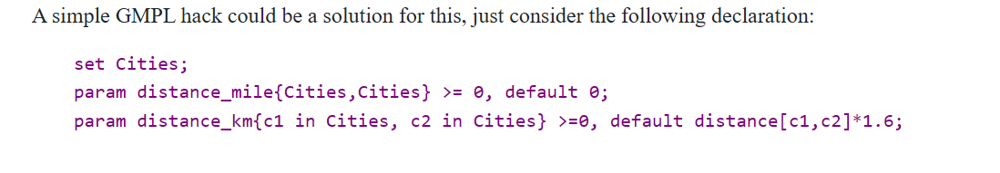

[Igaz/Hamis feladatok](#igazhamis-feladatok)


A GUSEK (GNU Linear Programming Kit Solver Kit) a GLPK (GNU Linear Programming Kit) grafikus felülete, amely a GMPL-t (GNU Math Programming Language) használja a matematikai modellek megfogalmazására. A GMPL egy deklaratív programozási nyelv lineáris és vegyes egészértékű programozási problémák modellezésére, és olyan elemeket és függvényeket tartalmaz, amelyek lehetővé teszik a modellek paramétereinek, változóinak és célfüggvényeinek meghatározását, valamint a feltételek megadását.

Az alábbiakban egy összeállítást találsz a GMPL szintaxisának fő elemeiről és függvényeiről:

### 1. **Set-ek (Halmazok)**
A GMPL-ben halmazok definiálásával lehet csoportosítani a modellek különböző elemeit, például termékek, gépek, időszakok.

```glpk
set I;          # Általános halmaz I megadása
set J, dimen 2; # Kétdimenziós halmaz J megadása
```

**Tartományt is adhatunk meg egy halmaznak**:
```glpk
set K := {1..10}; # K halmaz, elemei 1-től 10-ig
```

### 2. **Paraméterek**
A paraméterek lehetnek konstans értékek, vagy indexált értékek, amelyek egy halmaztól függenek.

```glpk
param a;              # Egy egyszerű paraméter
param b{i in I};      # Egy halmaz által indexált paraméter
param c{(i,j) in J};  # Kétdimenziós paraméter
```

**Értékadás paramétereknek**:
```glpk
param d := 5;                # d értéke 5
param e{i in I} := i*2;      # Minden i esetén e értéke i*2
param f{(i,j) in J} := i+j;  # Minden (i,j) esetén f értéke i+j
```

### 3. **Változók**
A változók meghatározása során megadhatjuk azok típusát (pl. folytonos vagy egészértékű) és tartományát.

```glpk
var x >= 0;                    # Nemnegatív folytonos változó
var y{i in I} >= 0, <= 10;     # Változók, amelyek 0 és 10 közöttiek
var z, binary;                 # Bináris változó (0 vagy 1)
var w, integer, >= 0, <= 100;  # Egészértékű változó
```

### 4. **Célfüggvény**
A célfüggvény (objective function) megadja, hogy mit optimalizálunk (minimalizálni vagy maximalizálni szeretnénk).

```glpk
minimize Total_Cost: sum{i in I} c[i] * x[i];  # Költség minimalizálása
maximize Profit: sum{(i,j) in J} p[i,j] * y[i,j]; # Profit maximalizálása
```

### 5. **Korlátozások (Constraints)**
A korlátozások egyenletek vagy egyenlőtlenségek, amelyekkel meghatározhatjuk a megoldáshoz szükséges feltételeket.

```glpk
s.t. Capacity{i in I}: sum{j in J} a[i,j] * x[j] <= b[i];  # Kapacitás korlát
s.t. Demand{j in J}: sum{i in I} d[i,j] * x[i] >= r[j];    # Kereslet korlát
```
### 6. **Kiiratás**

```glpk
param OverallChocolates := sum{s in Students, t in Tantargyak} MilkacsokiAr[s, t] * x[s, t];
display OverallChocolates;
# vagy egy másik, szebb módszer
printf "Subjects assigned to each student:\n";
for {s in Students} {
    printf "%s: ", s;
    for {t in Tantargyak: x[s, t] = 1} {
        printf "%s ", t;
    }
    printf "\n";
}
```

### 7. **Adatok Betöltése és Kiíratása**
Az adatokat külső fájlokból lehet betölteni, vagy fájlba lehet kiírni. Például `.dat` fájlokat használnak a paraméterek értékeinek definiálására.

```glpk
data;  # Adatok betöltése
param a := 10;
param b := [1, 2, 3];
end;
```

Adatok mentése fájlba:
```glpk
display x > "output.txt"; # x változó értékeinek kiíratása fájlba
```  

Vagy ahogy én csinálom:
```bash
>C:\Users\medav\Downloads\gusek_0-2-24\gusek\glpsol.exe --cover --clique --gomory --mir -m "name.mod" -d "name.dat" -o "name.out" -y "name.txt"
```  

### 8. **Conditional (Feltételes) Értékadás**
~~GMPL-ben az `if` kifejezést használhatjuk a feltételes értékadáshoz.~~  
Nem, mert big M konstanst adunk meg.    
```glpk
M * yi > xi
```
where M is a large constant (greater than any value of xi).  

This way:  

if xi > 0, then the constraint is equivalent to yi > 0, that is yi == 1 since yi is binary (if M is large enough).  
if xi == 0, then the constraint is always verified, and yi will be equal to 0 since your objective is increasing with yi and you are minimizing.
in both case, the constraint is equivalent to the "if" test.  

vagy ha ismert változók, akkor if then else

### 9. **Kommentek**
A kommenteket a `#` jellel lehet megadni. Ezeket a fordító figyelmen kívül hagyja.

```glpk
# Ez egy komment, amit a fordító nem dolgoz fel
```

### Példa Modell

Íme egy egyszerű modell a GMPL nyelven, amely bemutatja a fenti elemeket egy összeállításban:

```glpk
set Products;
param Cost{Products} >= 0;
param Profit{Products} >= 0;
param MaxDemand{Products} >= 0;

var x{p in Products} >= 0, integer;

maximize Total_Profit:
    sum{p in Products} Profit[p] * x[p];

s.t. Cost_Constraint:
    sum{p in Products} Cost[p] * x[p] <= 1000;

s.t. Demand_Constraint{p in Products}:
    x[p] <= MaxDemand[p];

solve;

display x;
```

## Set Default



## Symbolic

set Cities; # strings
param lastCity symbolic in Cities;

## Transpose

A rookie mistake is to define a 2 dimensional parameter, and mix up its indices. That usually results in "out of domain" error messages. Replacing p[b,t] with p[t,b] everywhere where it was wrongly used in the constraints is a bit tiresome, but can be done swiftly.

A more serious headache will come around if we gave the values in the data section the other way around. That is especially true for huge tables. A small example:

    set A;
    set B;
    param p{A,B};
    ...

    data;

    set A := a1 a2 a3 a4;
    set B := b1 b2 b3;

    param p :
          a1  a2  a3  a4 :=
      b1  12  34  54  12
      b2  98  87  76  65
      b3  78  65  67  43
      ;    
  
The several options we have:

Manually (or with an external tool) transpose the matrix in the data section.
Change the order of the indices in the declaration, and eveywhere in the model
put (tr) after param p and before the colon in the data section
## Igaz/Hamis feladatok

## I

1. Csak akkor fordulhat elo, hogy egy LP modellnek nincs megoldasa, ha a valtozok szama kevesebb, mint a korlatozasok szama. ❌ hülye korlátozás, rossz adatok
2. A szimplex modszer masodik fazisanak feladata, hogy egy nem bazismegoldasbol bazimsegoldasba keruljunk. ❌ mindkettő bázismo.
3. Tulzottan nagy M ertek megvalasztasa eseten a megoldok numberikus hibara futhatnak. ✔ mantissza váltás néha furcsa lehet
4. GMPL nyelven egy set elemei csak szimbolikus ertekek lehetnek. ❌ numerikus is
5. Heurisztikanak az olyan modszereket nevezzuk, melyek a lehetseges donteseket moho modon hozzak meg. ❌ nem csak mohó, ez algoritmusokat kisegítő alternatíva szokott lenni

## II

1. Minden MILP feladatnak van legalább egy optimális megoldása. ❌ bs
2. A preprocessing a MILP megoldóban az, amikor memóriát foglal a paramétereknek, és kiszámolja az értéküket. ❌ de glpsol pl ezt csinálja
3. LP modellben nem megengedett két folytonos változó összeszorzása, de MILP modellekben igen. ❌ bináris és folytonos legfeljebb
4. Egy változónak legfeljebb két alsó indexe lehet. ❌ (dimenziók száma végtelen lehet)
5. Halmazok leszükítésében (kapcsoson belül a kettőspont utáni rész) használhatók a paraméterek. ✔ s.t. Foo{f in FooSet: f!=1}
6. Lehet a modellben olyan korlátozás, melyben a modell összes változója szerepel nem 0 együtthatóval. ✔ 5* xNKF+ 3*xNF + 2 * KF...
7. A szimplex algoritmus önmagában nem tud MILP feladatokat megoldani. ✔ csak a folytonos változókra alkalmazható, ahhoz már kell hozáz egy Branch and Bound vagy hasonló algoritmus is

## III

1. Mik az előnyei, hátrányai egy részletesebb modellnek egy egyszerűbbel szemben?
   - Előny:
     - Pontosabb eredmény
   - Hátrány:
     - Nagyobb számítási igény
     - Több változó, korlátozás
     - Több memória
     - Bonyolultabb

2. Lehet-e egy LP feladatnak pontosan kettő optimális megoldása? ❌ 0, 1, végtelen

3. Mit fejez ki az alábbi korlátozás? [single selection]

        s.t. Foo {p in Products} : sum {t in Tools} compatible[p,t] * bought[t] >= 2;

4. Mely módszerek garantálják az optimális megoldás megtalálását? [multiple selection]

    • Genetikus algoritmus ❌ (csak szuboptimális)
    • Korlátprogramozás ✔
    • Lineáris programozás ✔
    • Lokális keresés ❌ (csak szuboptimális)

5. Mi az, ami korlátprogramozásban megengedett, de MILP-ben nem? [multiple selection]

    • Változók összeszorzása a korlátozásokban ✔
    • Változóval való tömbindexelés ✔
    • Törtszám típusú változók ❌
    • Nemegyenlő korlátozás (!=) ✔

## IV

1. Mit jelent ha egy módszer `egzakt`?
   - Ha garantálja az optimális megoldást - pl: Brute Force algoritmus

2. Mit jelent a `szuboptimális`?
   - Nem optimális de közel van az optimálishoz

3. Mi a különbség a `matematikai` és a `valós modell` között?
   - A matematikai modellből kimarad pár tényező amit a valós modellbe vissza kell helyettesíteni

4. Mik az `LP` (lineáris programozási modell) szabályai?

   - véges sok folytonos változó
   - véges sok korlátozás
   - a korlátozásoknak lineárisnak kell lenni:
     - Az egyes megszorítások bal oldala (LHS) a változók lineáris kifejezése
     - Minden megszorítás jobb oldala (RHS) egy konstans
   - relációk: <= , >= , =
   - 1 célfüggvénynek kell lennie, ami lineáris. Ezt szeretnénk minimalizálni vagy maximalizálni

5. Mi az a `MILP`?

   - (Mixed-Integer Linear Programing) vegyes egészértékü lineáris programozás
   - ez egy matematikai optimalizálási módszer
   - ebben az egyes változók csak egész számokat vehetnek fel, míg más változók lehetnek folytonosak (valós számok)

6. Melyik oldja meg az LP feladatot?

   - Szimplex megoldo (IGEN✅) => NEM CSAK SZIMPLEX MEGOLDÓ !!!
   - LP megoldo (IGEN✅)
  
7. Mi az a `CPLEX` és a `GUROBI`?

   - Mind a CPLEX, mind a GUROBI nagy teljesítményű kereskedelmi optimalizálási megoldások, amelyeket széles körben használnak lineáris programozás, vegyes egészszámú programozás és másodfokú programozási problémák megoldására. Mindkét megoldó fejlett algoritmusokat és funkciókat kínál a problémák széles skálájának optimalizálásához különböző területeken, beleértve a pénzügyet, az energiát, a szállítást és a logisztikát.

8. Egy feasible érték tartománya lehet-e konkáv? nem, csak konvex
9. `2 dimenzió`
    - 2 dimenzionál 2 változó van
    - megoldások:
       - nincs megoldás
       - 1 megoldás
       - végtelen sok megoldás
       - nem korlátos megoldás (nem adtam meg korlátot neki tehát nyitott)
    - egyenest tolunk el

10. `3 dimenzió`
    - 3 dimenziónál 3 változó van
    - síkot tolunk el
    - A csúcsok a bázismegoldások

11. Hogyan hívják a `Szimplex` fázisait?

    - Szimplex I. fázis
      - Bázis megoldás megtalálása
    - Szimplex II. fázis
      - Bázis megoldás javítása

12. Szimplex megoldás: Standard Lineáris Programozási Forma

13. Mi a MILP és az LP közti különbség?

    | Jellemző              |           LP          |           MILP        |
    |:---------------------:|:---------------------:|:---------------------:|
    | Változók              | Folytonos             | Folytonos és egész    |
    | Megoldási algoritmusok| Szimplex              | B&B, Cutting planes, Szimplex(de nem elég önállóan!) |

    - Simplex nem képes közvetlenül kezelni az egészértékű változókat.

14. Szimplex
    - x >= 0
    - Ax <= b
    - c<sup>T</sup>x -> min/max

15. Hány megoldás van ha:

    - eltérő egyenletek száma  =  változók = 1 megoldás
    - eltérő egyenletek száma  >  változók = nincs megoldás
    - eltérő egyenletek száma  <  változók = végtelen megoldás

16. Mi az a `bázis`?
    - A lineáris algebrában egy vektortér `bázisa` egy olyan vektorhalmaz, melyben lévő elemek egymástól lineárisan függetlenek és lineáris kombinációik megadják a vektortér minden elemét (azaz `generátorrendszert` alkotnak)
    - A bázis egy **minimális számú generátorrendszere** a térnek és egy maximális számosságú, egymástól lineárisan független elemekből álló részhalmaza is egyben.

17. Mi az a `generátor rendszer`?
    - Egy vektortér generátorrendszere egy olyan vektorhalmaz, melynek lineáris kombinációi a **vektortér összes elemét előállítják**.
    - Tehát bármelyik vektort előállíthatom a generátorrendszer vektorainak lineáris kombinációjával.

18. Mi az a `SLACK variable` ?
    - LHS és RHS között egyelőtlenség van: szerzünk egy SLACK variable-t [s >= 0]
    - LHS <= RHS
      - LHS + s = RHS
    - LHS >= RHS
      - LHS - s = RHS

19. Mi az az `árnyékköltség`?
    - c<sub>j</sub> - c<sub>t</sub>B · B<sup>-1</sup> · a<sub>j</sub>
    - Árnyékköltség egy mérőszám, ami megmutatja, hogy egy adott korlát/feltétel változtatása (pl. bázismegoldás változtatása) hogyan hat a célfüggvény értékére

20. Mi az a `LHS` és az `RHS`?
    - LHS: A kifejezés bal oldala, azaz az az oldal, amely a korlátozásokban a változókat tartalmazza.
    - RHS: A kifejezés jobb oldala, amely általában egy konstans érték.

21. Mi az a `GMPL`?
    - modellező nyelv
    - A GLPK keretrendszerben a modelljeinket a GMPL nyelven írjuk le
    - Az LP és a MILP modellek leírását segíti

22. Mi az a `GPLK`?
    - szoftvercsomag

23. Mi az a `GUSEK`?
    - grafikus felhazsnálói felület
0
24. Mi az a `GLPSOL`?
    - parancssoros megoldóeszköz
    - A GLPK része

25. Mi az a `Preprocessing`?
    - A preprocessing (előfeldolgozás) az optimalizálási problémák megoldása előtt alkalmazott lépések összessége, amelynek célja a probléma egyszerűsítése, hogy a megoldási folyamat gyorsabb, hatékonyabb legyen.
    - Lépései:
      - Változók és korlátok egyszerűsítése
        - Redundáns korlátok eltávolítása
        - Fixált változók
        - Túl szoros vagy túl enyhe korlátok, felesleges korlátok
      - Felesleges együtthatók eltávolítása
      - Lineáris és nemlineáris problémák egyszerűsítése
      - Korlátozott erőforrások kezelése:
        - Memória optimalizálás
      - Próbalépcsős keresési technikák:
        - Bizonyos esetekben az előfeldolgozás tartalmazhat egy gyors próbamegoldási lépést, hogy meghatározzuk a probléma egyszerűsített verziójának megoldásait, amely segíthet a további optimalizálás irányának meghatározásában.

26. Mit jelent az, hogy egy set `szimbolikus`?
    - A set nem numerikus adatokat tárol, például set Cities: London, Paris, Budapest...

27. Mit jelent az, hogy `politóp`?
    - Ez egy multidimenziós objektum, ahol (optimalizálásban) éleken haladunk iteratívan optimális mo.-ért. Az opt. mo. nemcsak lokális, globális optimum.

28. Mit jelent a `feasible`?
    - Minden kikötésnek megfeleltett megoldás

29. Mikor nem kapunk bázismegoldást?
    - Bázismegoldást nem kapunk, ha:
      - A probléma nem oldható meg (infeasibility),
      - A probléma korlátlan (unbounded),
      - Degenerált problémával találkozunk, ami miatt a módszer nem tud lépni új megoldás felé,
      - Nem megfelelő kezdő bázis van, vagy
      - A korlátozások hibásan vannak megfogalmazva.

## V

### Értékelés az Igaz/Hamis feladatokra:

1. **Egy lineáris programozási (LP) modellnek mindig létezik megoldása, ha a változók száma nagyobb, mint a korlátozások száma.**  
   **Hamis**. A változók száma és a korlátozások száma nem garantálja automatikusan a megoldhatóságot. Például, ha a korlátozások ellentmondásosak, az LP problémának nincs megoldása.  

2. **A nagy M érték túlzottan magas megválasztása hibákhoz vezethet a numerikus számításokban.**  
   **Igaz**. A "Big-M" módszer túlzottan nagy értékei numerikus instabilitást okozhatnak a számítás során, ezért az \( M \) értékének körültekintő megválasztása szükséges.  
   Ez kerekítési hibákat és rossz oszlop-skálázást eredményezhet.
   Például: ha egy egyenletben az egyik együttható 1, míg egy másik 10 a hatodikon, akkor a kis együttható "elveszhet" a számítási hibák miatt.

3. **Egy bináris változó és egy folytonos nemnegatív változó szorzata lineárisítással modellezhető.**  
   **Igaz**. Ez egy ismert technika az LP-ben és a vegyes egészértékű programozásban (MILP). Például az \( x \cdot y \) szorzatot (ahol \( x \) bináris) lineáris korlátozásokkal helyettesítjük.  

4. **A Froccs modellnél minden terméket azonos mennyiségű alapanyag felhasználásával állítanak elő.**  
   **Hamis**. A Froccs modellben az egyes italok eltérő mennyiségben használnak szódát és bort.  

5. **A szimplex módszer alapvetően iteratív algoritmus, amely egy optimalizálási problémát egyre jobb bázismegoldásokkal közelít.**  
   **Igaz**. A szimplex módszer iteratívan halad a bázismegoldások között, amíg el nem éri az optimumot, de az első fázis nem az optimalizálásra, hanem a megoldás elindítására szolgál.  
---

### Értékelés a Kakukktojás feladatokra:

#### I. **Melyik állítás igaz?**  
- **A GMPL modellek támogatják a generikus változódeklarációkat.**  
  **Igaz.** A GMPL lehetőséget ad generikus változók, például halmazokon értelmezett változók definiálására.   pl. param quantity{Products} ...

- **A Froccs modellben az alapanyagkészlet nem lehet véges.**  
  **Hamis.** Az alapanyagok, mint például szóda és bor, készlete véges a modellben.  

- **A szállítók által felhasznált maximális munkaidőt nem kell korlátozni az időkeret modellekben.**  
  **Hamis.** A maximális munkaidőt korlátozni kell, különben a modell irreális eredményeket adhat.  

- **A bináris változók kizárólagos kapcsolatai modellezhetők úgy, hogy a summázásokat egyenlőtlenségekkel kombináljuk.**  
  **Igaz.** Ez egy szokásos modellezési technika, például a Big-M használatával.  

#### II. **Melyik nem helyes technikai megállapítás?**  
- **A bináris változók GMPL-ben "binary" jelzővel deklarálhatók.**  
  **Igaz.** Ez a helyes deklarációs forma GMPL-ben.  

- **A célfüggvény minden esetben maximalizáló irányba hat.**  
  **Hamis.** A célfüggvény lehet minimalizáló vagy maximalizáló, az adott probléma függvényében.  

- **A Big-M módszerrel komplex feltételek is kezelhetők.**  
  **Igaz.** A Big-M technika lehetővé teszi feltételek lineáris formában történő kezelését.  

- **A szimplex algoritmus második fázisa a bázismegoldások közötti mozgásra koncentrál.**  
  **Igaz.** Ez az algoritmus második fázisának lényege.  